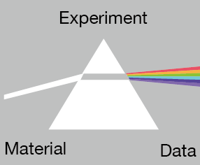

# Trinity Open Psychology Experiments(TOPE)

<<<<<<< HEAD
三位一体オープン心理学実験プロジェクト（Trinity Open Psychology Experiments Project）の達成のためにこのサイト「Trinity　Open Psychology Experiments」は作成されました。
=======

>>>>>>> 92d722bb1a0311e0ab67a22e2b9cb7e1effb7934

<<<<<<< HEAD
{: .warning}
現在はテスト運用中のため，データ収集などには利用しないでください。

## Trinity Open Psychology Experiments Projectとは
=======
三位一体オープン心理学実験プロジェクト（Trinity Open Psychology Experiments Project）の一環としてこのサイトを作成しました。
本プロジェクトは以下のような3つの目標を達成することを目指します。3つの目標が相互に関連するため，本プロジェクトに「三位一体」の名を冠しました。
>>>>>>> 92d722bb1a0311e0ab67a22e2b9cb7e1effb7934

{: .warning}
現在はテスト運用中です。

## TOPEの3つの目標

### 1. オープンなオンライン心理学実験の実施環境（Open Experiment）

オンライン心理学実験の実施環境の公開（提供）を目指します。

### 2. オープンなオンライン心理学実験プログラム（Open Materials）

オンライン心理学実験のプログラムの公開（提供）を目指します。

### 3. オープンなオンライン心理学実験データ（Open Data）

1.オープンなオンライン心理学実験で収集したデータの公開（提供）を目指します。

## 利用上の注意点など

### ライセンス

実験プログラムにはMITライセンスを適用しています。データにはCC-By Attribution 4.0 Internationalを適用しています。各ライセンスに沿った適切な利用をお願いいたします。

### 注意事項

本サイト及び本プロジェクトは非営利かつ有志によって運営されています。本サイト利用時のトラブルや不利益など（本サイトが利用できない場合に生じた不利益を含む）について，作成者はすべての責任は負いません。ご了承ください。

### 問い合わせ先

小林正法（山形大学）：mk [at] human.kj.yamagata-u.ac.jp